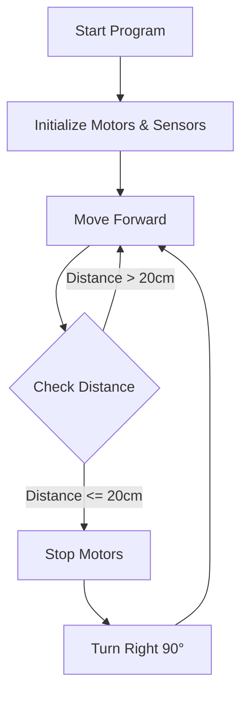

# LEGO Spike Prime - Obstacle Avoidance Robot Project Plan

## Project Overview
Build a mobile robot using LEGO Spike Prime that can navigate autonomously and avoid obstacles using an ultrasonic sensor.

## Hardware Requirements
- **LEGO Spike Prime Hub**: Main controller
- **2 Large Motors**: For differential drive system (left and right wheels)
- **1 Ultrasonic Sensor**: For obstacle detection (mounted at front)
- **1 Color Sensor**: For optional floor detection or future enhancements
- **LEGO building pieces**: For chassis construction

## Robot Design

### Chassis Structure
```
     [Ultrasonic Sensor]
            |
    +-----------------+
    |   Spike Hub     |
    |                 |
    +-----------------+
    |                 |
[Motor]           [Motor]
  (L)               (R)
    |                 |
[Wheel]           [Wheel]
```

### Component Layout
1. **Drive System**: Two-motor differential drive
   - Left motor on Port A
   - Right motor on Port B
   - Wheels should be same size for balanced movement

2. **Sensor Placement**:
   - Ultrasonic sensor on Port C (front-facing, ~10-15cm above ground)
   - Color sensor on Port D (bottom-facing, optional for future use)

## Software Architecture

### Program Flow


### Key Functions

1. **Initialization**
   - Import required libraries (motor, distance_sensor)
   - Set motor ports (A, B)
   - Set sensor ports (C, D)
   - Configure motor speeds and directions

2. **Movement Control**
   - `move_forward()`: Drive both motors forward at equal speed
   - `stop()`: Stop both motors
   - `turn_right()`: Rotate robot by running motors in opposite directions
   - `turn_left()`: Alternative turning direction (optional)

3. **Obstacle Detection**
   - Continuously read ultrasonic sensor distance
   - Threshold: 20cm (adjustable during testing)
   - Trigger avoidance behavior when obstacle detected

4. **Main Loop**
   - Move forward while no obstacles detected
   - When obstacle detected: stop → turn → resume forward movement
   - Repeat indefinitely

## Implementation Steps

### Phase 1: Hardware Assembly
1. Build stable chassis with Spike Hub mounted centrally
2. Attach motors to chassis with wheels
3. Mount ultrasonic sensor at front (facing forward)
4. Mount color sensor at bottom (optional)
5. Ensure all connections are secure

### Phase 2: Basic Movement
1. Create Python program file
2. Initialize motor and sensor libraries
3. Test individual motor control
4. Implement forward movement
5. Test and calibrate motor speeds for straight movement

### Phase 3: Obstacle Detection
1. Test ultrasonic sensor readings
2. Implement distance checking in main loop
3. Add stop behavior when obstacle detected
4. Calibrate detection threshold (start with 20cm)

### Phase 4: Avoidance Behavior
1. Implement turning function (90° right turn)
2. Integrate turn into obstacle detection logic
3. Test complete avoidance sequence
4. Fine-tune turning angle and duration

### Phase 5: Testing & Refinement
1. Test in various environments
2. Adjust distance threshold if needed
3. Optimize turning angles
4. Add error handling
5. Document final parameters

## Code Structure (Python)

```python
# Import libraries
from spike import PrimeHub, Motor, DistanceSensor

# Initialize components
hub = PrimeHub()
left_motor = Motor('A')
right_motor = Motor('B')
distance_sensor = DistanceSensor('C')

# Configuration
SPEED = 50  # Motor speed (0-100)
OBSTACLE_THRESHOLD = 20  # Distance in cm
TURN_DURATION = 500  # Turn time in ms

# Movement functions
def move_forward():
    # Drive both motors forward
    
def stop():
    # Stop both motors
    
def turn_right():
    # Turn robot right ~90 degrees

# Main program loop
while True:
    # Check for obstacles
    # If clear: move forward
    # If obstacle: stop, turn, continue
```

## Testing Checklist

- [ ] Motors run at equal speeds for straight movement
- [ ] Ultrasonic sensor provides accurate distance readings
- [ ] Robot stops reliably when obstacle detected
- [ ] Turning angle is sufficient to avoid obstacles
- [ ] Robot can navigate around multiple obstacles
- [ ] Battery level is sufficient for extended operation
- [ ] All connections remain secure during movement

## Potential Enhancements

1. **Variable Speed**: Slow down as approaching obstacles
2. **Smart Turning**: Alternate between left/right turns
3. **Color Detection**: Stop on specific floor colors
4. **Sound Feedback**: Beep when obstacle detected
5. **LED Indicators**: Show robot status with hub lights
6. **Random Exploration**: Add randomness to turning direction

## Safety Considerations

- Test in open area free of fragile objects
- Ensure robot cannot fall off tables/edges
- Monitor battery level during operation
- Secure all LEGO connections before running
- Keep hands clear of moving parts

## Expected Outcomes

After completing this project, you will have:
- A functional autonomous robot
- Understanding of sensor-based decision making
- Experience with motor control and calibration
- Foundation for more complex robotics projects
- Reusable code patterns for future LEGO Spike projects

## Resources & References

- LEGO Spike Prime Python API documentation
- Ultrasonic sensor specifications (range: 4-200cm)
- Motor specifications (max speed, torque)
- Example projects from LEGO Education

---

**Next Steps**: Review this plan and let me know if you'd like to proceed with implementation or make any adjustments to the design!